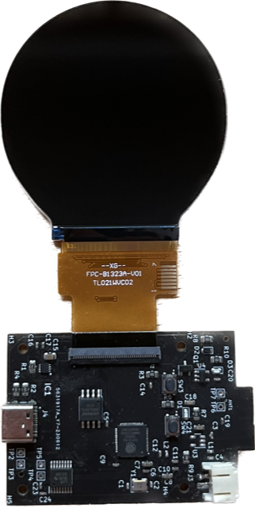

# Kitchen Scales

# Introduction

The weight scales is a modern take on a kitchen scales with a more up to date display. It displays up to 3KG and the load can bear up to 5KG. An animation also rotates around the circumference of the display with increasing weight for presentation. At the rear of the device is a power switch. The device contains a 1.8Ah rechargable battery. The front of the device contains a USB-C port for battery charging. You can turn the device on while charging if needs be. You can print the case with various parts to assemle this yourself. 3D print files are included in the 3mf folder. 

# Parts Included

For the 3D printed case I have included the 3mf files. This project includes the following,

- RGB (565) display with ST7701s IC driver,
- ESP32-S3 R8 (8MB PSRAM) and 4MB of flash memory,
- ADS1230 20-bit precision ADC (Texas Instruments),
- 5KG load cell (Adafruit),
- Lithium Polymer Rechargeable Battery, 1.8Ah
- Charging circuitry on PCB,
- USB-C,
- Lever Tactile Switch, DPDT,
- 3D print case

# Development Board

# Software 

- Kicad for PCB files,
- Fusion 360 for STL files,
- ESP-IDF for development environment,
- SquareLine Studio for display graphics

# Pinout

You can find the entire pinout with the schematic provided. But a brief overview is as follows,

Load Cell Pins

- TP2 - 3.3V,
- TP3 - GND,
- TP4 - AINP,
- TP5 - AINN

Buttons

- TP6 to TP7 for Power button,
- SW3 - Reset button,
- SW4 - Boot button

# Calibration

Due to the sensitivity of the load cell, the screw tightness of the load cells and the potential subtle minor variations of every printed case, its necessary to do a calibration of each scales. This is done by using a known weight as a reference so that an offset can be used to compensate for small difference. I include the weight of the metal plate in the calibration. The metal plate weights 55 grams so the metal plate plus a fixed 1kg weight is used for getting the reference. 

# Programming the device

There are two modes for the ESP32-S3, download mode (upload program) and run mode (code running). To put the board in program mode press and hold the button SW4 (boot) and while this is still being held press the SW3 (reset) button. To put the board into run mode just press SW3 (reset) button once or alternatively just unplug the device. 

- idf.py set-target ESP32-S3 (only need to do this once)
- idf.py build (rebuild when you make changes to code)
- idf.py flash -p COM8 -b 921600 monitor (download code while monitoring)

# Further Work/Problems

There are inaccuracies occuring for small weight values. eg an item less than 10 grams might not register as a load. This could be to do with the plastic materials having a damping effect where load is not apparent on cantilever and is dampened into soft plastic. More rigid plastic for the base plate would be recommended instead of PLA. I purposefully put 1 end of cantilever in the middle of the base plate to minimise the edges of the plastic being pulled/bent upwards from the load applied. In addition, there seems to be around 2 grams difference for different charge levels of the battery. The ADC code is very surface level and could use more filtering/considerations for noise. 

